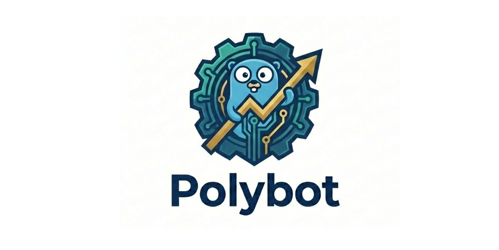
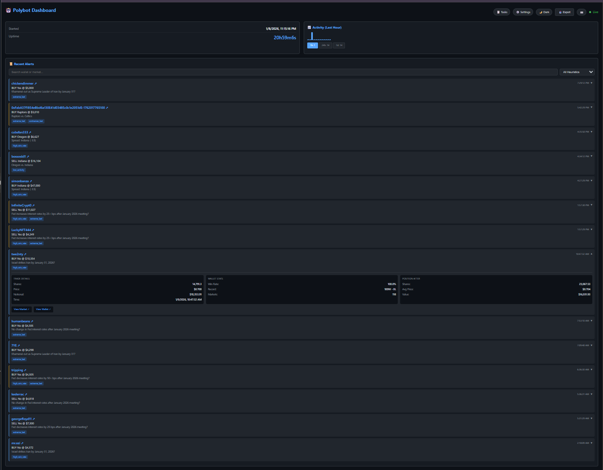
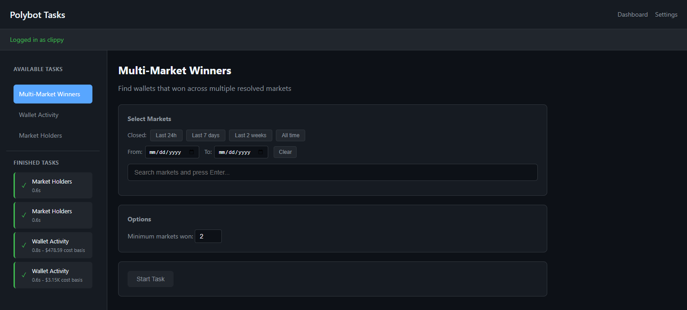
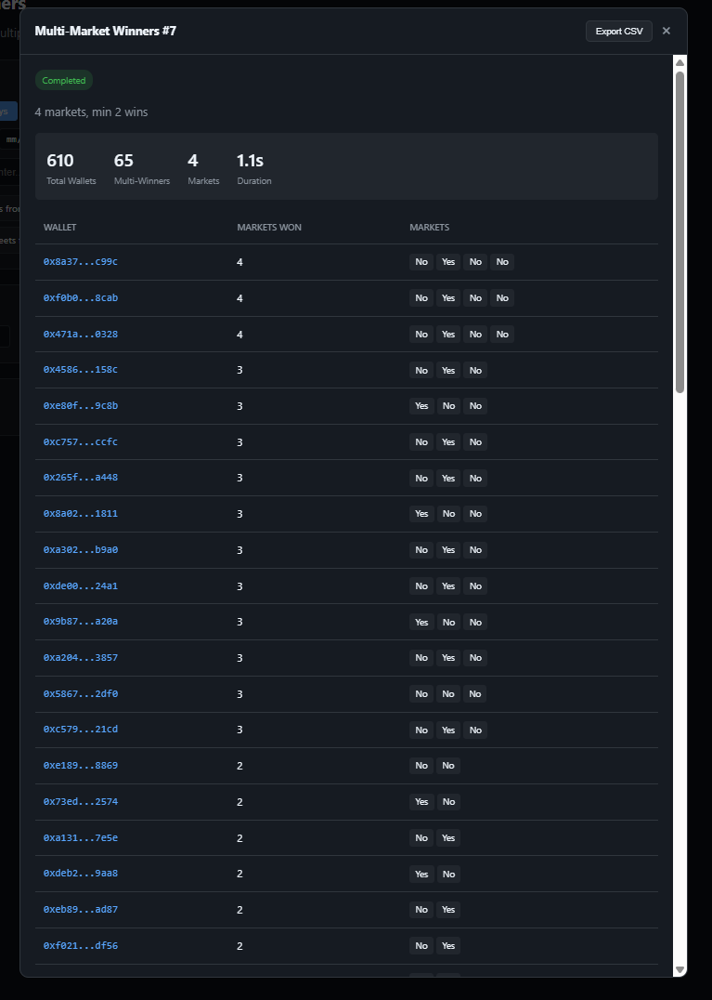
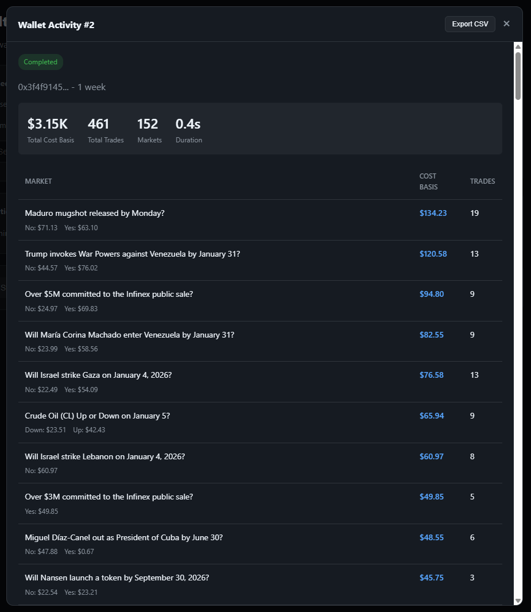
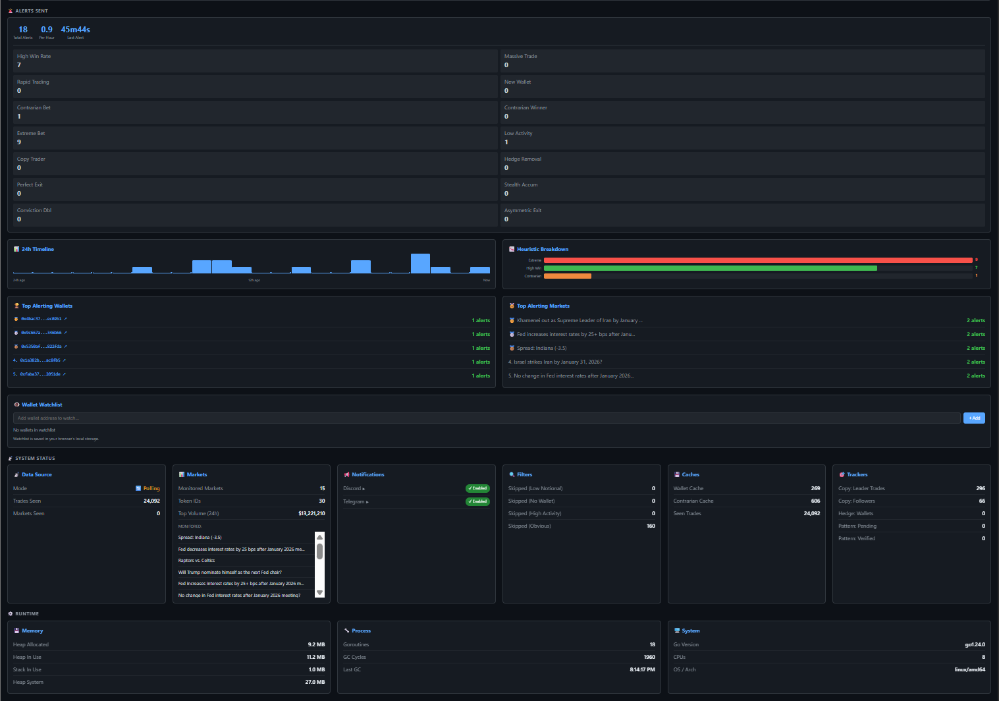
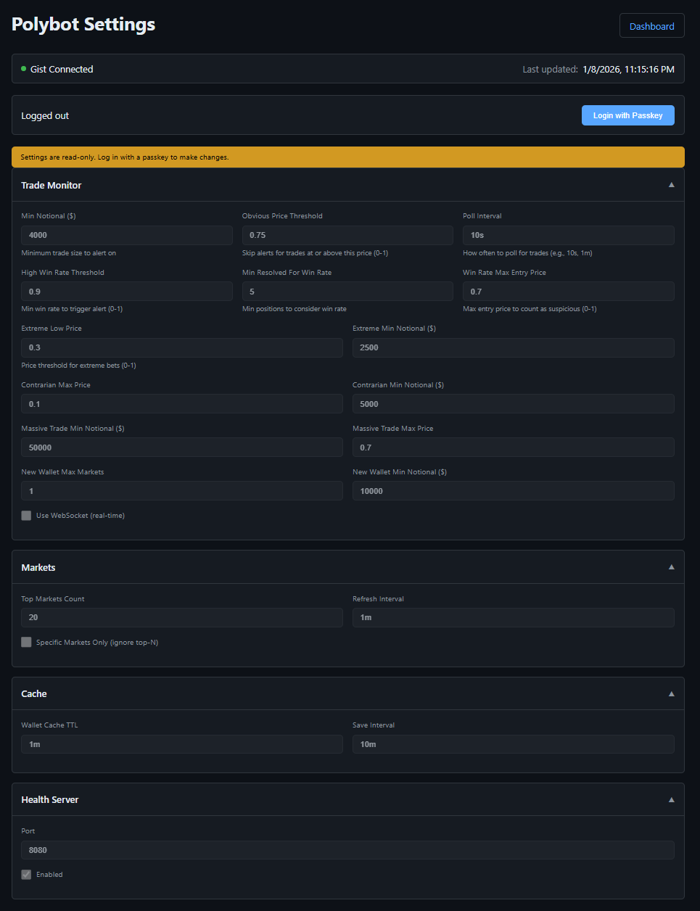
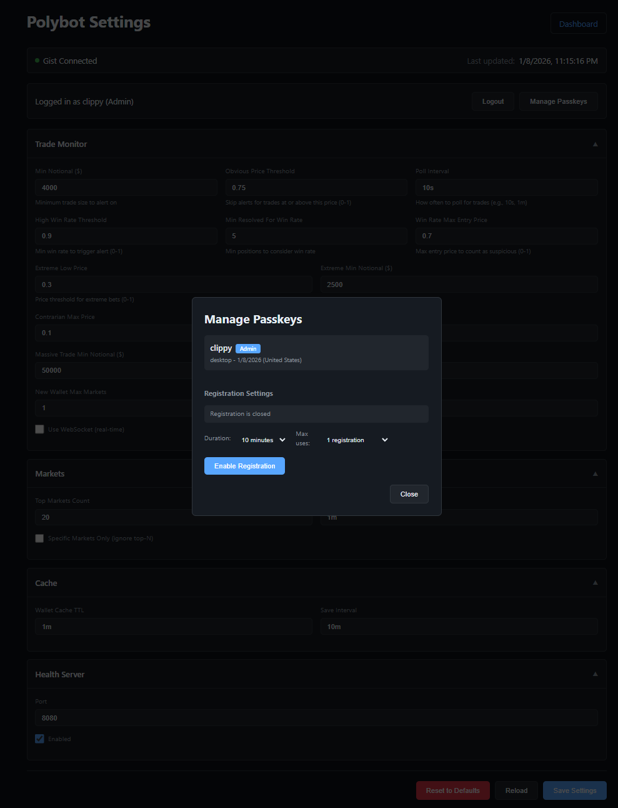
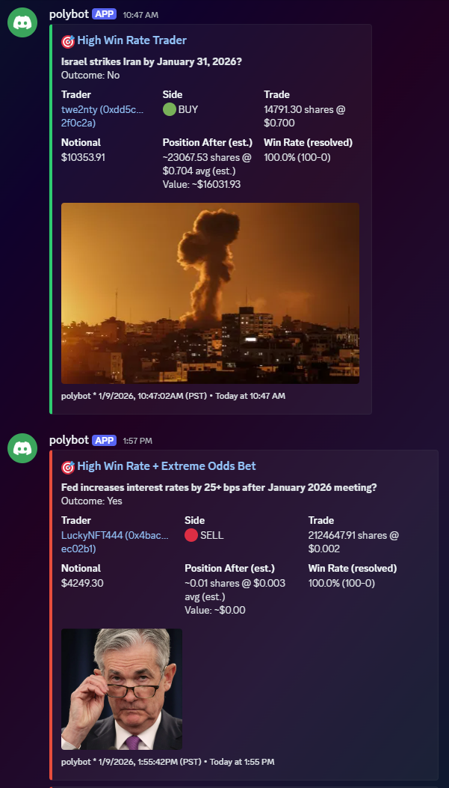

<p align="center">
  
</p>

<p align="center">
  A real-time monitoring and analysis tool for <a href="https://polymarket.com">Polymarket</a>.<br>
  Get alerts on potentially interesting trading patterns and analyze wallet activity, market holders, and cross-market winners.
</p>



## What Does It Do?

Polybot helps you stay informed about Polymarket trading activity:

- **Real-time Alerts**: Get notified on Discord/Telegram when trades match interesting patterns (whale trades, high win-rate traders, contrarian bets, and more)
- **Market Analysis**: Find the largest position holders in any market
- **Wallet Analysis**: See any wallet's trading activity and cost basis across markets
- **Cross-Market Analysis**: Discover wallets that correctly predicted outcomes across multiple markets

## Quick Start

### 1. Deploy Polybot

```bash
# Clone the repository
git clone https://github.com/swiftyspiffy/polybot.git
cd polybot

# Set minimum required environment variables
export DISCORD_BOT_TOKEN="your-discord-bot-token"

# Run
go run .
```

The dashboard will be available at `http://localhost:8080`

### 2. Access the Dashboard

Open your browser to the dashboard URL. You'll see:
- Live connection status
- Markets being monitored
- Recent alerts
- Top alerting wallets

### 3. Use the Tasks Page

Navigate to `/tasks` for analytical tools:

| Task | What It Does |
|------|--------------|
| **Multi-Market Winners** | Find wallets that won on multiple resolved markets |
| **Wallet Activity** | Analyze any wallet's cost basis and trading history |
| **Market Holders** | See who holds the largest positions in any market |

### 4. Configure Settings

Navigate to `/settings` to:
- Set up passkey authentication (optional security)
- Filter which market categories to monitor (politics, sports, crypto, etc.)

---

## Features

### Real-time Trade Alerts

Polybot monitors the top markets by volume and sends alerts when trades match these patterns:

| Pattern | What It Catches |
|---------|-----------------|
| **Whale Trade** | $50,000+ trades |
| **High Win Rate** | Traders with 90%+ win rate on 5+ resolved positions |
| **Low Activity Wallet** | Wallets in ≤5 markets making large trades |
| **Contrarian Bet** | Large bets against consensus at low prices |
| **New Wallet** | New wallets making large first bets ($10k+) |
| **Extreme Odds** | Large bets at very low prices (≤3¢) |
| **Copy Trading** | Wallets copying high-performers within minutes |
| **Rapid Trading** | Multiple large trades within 5 minutes |

See [docs/heuristics/](docs/heuristics/) for complete documentation on all 15 detection patterns.

### Tasks: Analytical Tools

Access at `/tasks` - three powerful tools for Polymarket analysis:



#### Multi-Market Winners
Find wallets that correctly predicted outcomes across multiple resolved markets.

**Use case**: Identify consistently successful traders or potential coordinated activity.

1. Search for resolved markets (filter by date range)
2. Select 2-20 markets
3. Set minimum markets won threshold
4. Get a list of wallets that won on multiple selected markets



#### Wallet Activity
Analyze any wallet's trading activity and cost basis.

**Use case**: Research a trader's strategy, see their market exposure, or analyze your own activity.

1. Enter a wallet address (find addresses on the [Polymarket leaderboard](https://polymarket.com/leaderboard))
2. Select time period (24h to 1 year)
3. See cost basis breakdown by market and outcome
4. Export results to CSV



**Note**: The Polymarket API limits results to 500 activities. For very active wallets, results may be incomplete.

#### Market Holders
Find the largest position holders for any market (open or closed).

**Use case**: See who's betting big on a market, identify whale positions, or research smart money.

1. Search for any market (shows OPEN/CLOSED status)
2. Select the market
3. See top holders for each outcome (Yes/No)
4. View their share count, average price, and cost basis
5. Export results to CSV

### Dashboard

The main dashboard (`/`) shows live statistics:

- **Connection Status**: WebSocket or polling mode, uptime
- **Markets**: Number monitored, top by volume
- **Recent Alerts**: Live feed with expandable details
- **Top Alerting Wallets**: Leaderboard of flagged wallets
- **Statistics**: Trades seen, alerts by type, cache status



### Settings

Configure Polybot at `/settings`:

- **Authentication**: Optional passkey (WebAuthn) protection
- **Category Filtering**: Choose which market categories to monitor





---

## Configuration

### Required Environment Variables

| Variable | Description |
|----------|-------------|
| `DISCORD_BOT_TOKEN` | Discord bot token for alerts |

### Optional: Notifications

| Variable | Description |
|----------|-------------|
| `DISCORD_PROD_CHANNEL_ID` | Discord channel for production alerts |
| `DISCORD_BETA_CHANNEL_ID` | Discord channel for beta/testing |
| `TELEGRAM_BOT_KEY` | Telegram bot token |
| `TELEGRAM_PROD_CHAT_ID` | Telegram chat ID for production |
| `TELEGRAM_BETA_CHAT_ID` | Telegram chat ID for beta |
| `STAGE` | Set to `PROD` for production channels |




### Optional: Persistence (Recommended)

Enable persistence so alerts and task history survive restarts:

| Variable | Description |
|----------|-------------|
| `GITHUB_TOKEN` | GitHub token with Gist scope |
| `CACHE_GIST_ID` | Gist ID for wallet cache |
| `TASKS_GIST_ID` | Gist ID for task history |
| `SETTINGS_GIST_ID` | Gist ID for settings |

### Optional: Filtering

| Variable | Default | Description |
|----------|---------|-------------|
| `TOP_MARKETS_COUNT` | `20` | Number of top markets to monitor |
| `SPECIFIC_MARKETS` | - | Comma-separated condition IDs to always monitor |
| `SPECIFIC_MARKETS_ONLY` | `false` | Only monitor specific markets |
| `SPECIFIC_WALLETS` | - | Only alert on these wallet addresses |

### Optional: Detection Thresholds

Fine-tune alert sensitivity:

| Variable | Default | Description |
|----------|---------|-------------|
| `TRADE_MIN_NOTIONAL` | `4000` | Minimum trade size (USD) to analyze |
| `TRADE_MASSIVE_MIN_NOTIONAL` | `50000` | Threshold for whale alerts |
| `TRADE_HIGH_WIN_RATE` | `0.90` | Win rate threshold (90%) |
| `TRADE_CONTRARIAN_MAX_PRICE` | `0.10` | Max price for contrarian alerts |

See the [full configuration reference](#full-configuration-reference) below for all options.

---

## Deployment

### Local Development

```bash
git clone https://github.com/swiftyspiffy/polybot.git
cd polybot
go run .
```

### Production (DigitalOcean App Platform)

1. Fork/clone this repository
2. Create a new App from your GitHub repo
3. Set environment variables in App settings
4. Deploy

### Docker

```bash
docker build -t polybot .
docker run -e DISCORD_BOT_TOKEN=your-token -p 8080:8080 polybot
```

---

## API Endpoints

| Endpoint | Description |
|----------|-------------|
| `/` | Dashboard |
| `/tasks` | Analytical tools |
| `/settings` | Configuration |
| `/health` | Health check (returns `{"status":"ok"}`) |
| `/stats` | JSON statistics |

---

## Full Configuration Reference

<details>
<summary>Click to expand all configuration options</summary>

### Core Settings

| Variable | Default | Description |
|----------|---------|-------------|
| `STAGE` | - | Set to `PROD` for production channel |
| `TOP_MARKETS_COUNT` | `20` | Number of top markets to monitor |
| `MARKET_REFRESH_INTERVAL` | `1m` | How often to refresh market list |
| `USE_WEBSOCKET` | `true` | Use WebSocket for real-time trades |
| `TRADE_POLL_INTERVAL` | `10s` | Polling interval (fallback) |
| `HEALTH_SERVER_ENABLED` | `true` | Enable HTTP server |
| `HEALTH_SERVER_PORT` | `8080` | HTTP server port |

### Detection Thresholds

| Variable | Default | Description |
|----------|---------|-------------|
| `TRADE_MIN_NOTIONAL` | `4000` | Minimum trade size in USD |
| `TRADE_MAX_MARKETS_FOR_LOW` | `5` | Max markets for "low activity" |
| `TRADE_HIGH_WIN_RATE` | `0.90` | Win rate threshold (90%) |
| `TRADE_MIN_RESOLVED_FOR_WIN_RATE` | `5` | Min resolved positions for win rate |
| `TRADE_EXTREME_LOW_PRICE` | `0.03` | Low price threshold (3¢) |
| `TRADE_EXTREME_MIN_NOTIONAL` | `2500` | Min for extreme odds alerts |
| `TRADE_RAPID_WINDOW` | `5m` | Time window for rapid trading |
| `TRADE_RAPID_MIN_COUNT` | `3` | Min trades in window |
| `TRADE_RAPID_MIN_TOTAL` | `5000` | Min total in window |
| `TRADE_NEW_WALLET_MAX_MARKETS` | `1` | Max prior markets for "new wallet" |
| `TRADE_NEW_WALLET_MIN_NOTIONAL` | `10000` | Min for new wallet alerts |
| `TRADE_CONTRARIAN_MAX_PRICE` | `0.10` | Max price for contrarian (10¢) |
| `TRADE_CONTRARIAN_MIN_NOTIONAL` | `5000` | Min for contrarian alerts |
| `TRADE_MASSIVE_MIN_NOTIONAL` | `50000` | Min for whale alerts |

### Contrarian Winner Tracking

| Variable | Default | Description |
|----------|---------|-------------|
| `CONTRARIAN_CACHE_GIST_ID` | - | Gist ID for cache |
| `CONTRARIAN_MIN_WINS` | `3` | Min wins to trigger alerts |
| `CONTRARIAN_MIN_RATE` | `0.70` | Min contrarian win rate |
| `CONTRARIAN_THRESHOLD` | `0.20` | Price threshold (<20% or >80%) |

### Copy Trading Detection

| Variable | Default | Description |
|----------|---------|-------------|
| `COPY_TRADE_WINDOW` | `10m` | Window to detect copies |
| `COPY_TRADE_MIN_COUNT` | `3` | Min copies to alert |
| `COPY_TRADE_LEADER_MIN_WIN` | `0.70` | Min win rate for leader |
| `COPY_TRADE_LEADER_MIN_RESOLVED` | `5` | Min positions for leader |

### Cache & Persistence

| Variable | Default | Description |
|----------|---------|-------------|
| `GITHUB_TOKEN` | - | GitHub token for Gist API |
| `CACHE_GIST_ID` | - | Gist ID for wallet cache |
| `TASKS_GIST_ID` | - | Gist ID for task history |
| `SETTINGS_GIST_ID` | - | Gist ID for settings |
| `WALLET_CACHE_TTL` | `1m` | Wallet stats cache TTL |
| `CACHE_SAVE_INTERVAL` | `10m` | How often to persist cache |

### API URLs

| Variable | Default | Description |
|----------|---------|-------------|
| `POLYMARKET_GAMMA_API_URL` | `https://gamma-api.polymarket.com` | Gamma API |
| `POLYMARKET_DATA_API_URL` | `https://data-api.polymarket.com` | Data API |

</details>

---

## Architecture

```
polybot/
├── main.go                 # Entry point
├── config/                 # Configuration from env vars
├── clients/
│   ├── discord/            # Discord notifications
│   ├── telegram/           # Telegram notifications
│   ├── gist/               # GitHub Gist persistence
│   ├── polymarketapi/      # Polymarket REST API
│   └── polymarketevents/   # Polymarket WebSocket
└── internal/app/
    ├── runner.go           # Main orchestrator
    ├── stats_server.go     # HTTP server & dashboard
    ├── tasks_handler.go    # Tasks page & API
    ├── settings_handler.go # Settings page & API
    ├── trade_monitor.go    # Trade monitoring
    └── ...                 # Detection heuristics
```

---

## Testing

```bash
go test ./...                           # Run all tests
go test ./... -cover                    # With coverage
go test ./... -coverprofile=coverage.out && go tool cover -html=coverage.out  # HTML report
```

---

## License

MIT
